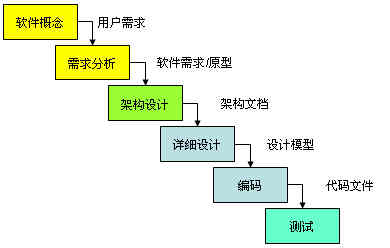
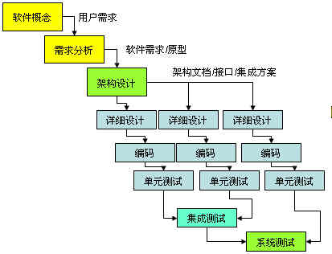
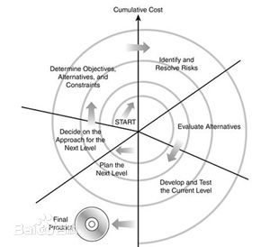

## 简述题

------
1.简述瀑布模型、增量模型、螺旋模型（含原型方法），并分析优缺点 
从项目特点、风险特征、人力资源利用角度思考

 - 瀑布模型：瀑布模型是最基本的和最效的一种可供选择的软件开发生命周期模型.瀑布模型要求软件开发严格按照需求 ->分析->设计->编码->测试的阶段进行,每一个阶段都可以定义明确的产出物和验证准则.瀑布模型在每一个阶段完成后都可以 组织相关的评审和验证,只有在评审通过后才能够进入到下一个阶段.
由于需要对每一个阶段进行验证,瀑布模型要求每一个阶段都有明确的文档产出,对于严格的瀑布模型每一个阶段都不应该重叠,而应该是在评审通过,相关的产出物都已经基线后才能够进入到下一个阶段.   
优点：可以保证整个软件产品较高的质量,保证缺陷能够提前的被发现和解决.采用瀑布模型可以保证系统在整体上的充分把握,使系统具备良好的扩展性和可维护性.        缺点：对于前期需求不明确,而又很难短时间明确清楚的项目则很难很好的利用瀑布模型.另外对于中小型的项目,需求设计和开发人员往往在项目开始后就会全部投入到项目中,而不是分阶段投入,因此采用瀑布模型会导致项目人力资源过多的闲置的情况。        
     
 - 增量模型：以架构为核心，在架构设计完成后系统会被分为相关的子系统和功能模块.每个功能模块间的接口都可以定义清楚.在这种情况下,当模块B的详细设计做完成后往往就没有必要等到其它模块的详细设计都要完全作完才开始编码,因此在架构设计完成后可以将系统分为多个模块并行开发,每个模块仍然遵循先设计和编码测试的瀑布模型思路.   
优点：在瀑布模型的基础上的改进，有着瀑布模型的优点，且进步不扩大化了瀑布模型的人力资源的利用率。  
缺点：通过多线程的方法压缩进度，多线之间较差的联系性可能导致项目的质量下降。         
     
 - 螺旋模型：螺旋模型是遵从瀑布模型即需求->架构->设计->开发->测试的路线，通过不断迭代和风险驱动。螺旋模型是一种演化软件开发过程模型，它兼顾了快速原型的迭代的特征以及瀑布模型的系统化与严格监控。   
优点：
    - 设计上的灵活性,可以在项目的各个阶段进行变更。     
    - 以小的分段来构建大型系统,使成本计算变得简单容易。    
    - 客户始终参与每个阶段的开发,保证了项目不偏离正确方向以及项目的可控性。   
    - 随着项目推进,客户始终掌握项目的最新信息 , 从而他或她能够和管理层有效地交互。    
    - 客户认可这种公司内部的开发方式带来的良好的沟通和高质量的产品。   
    
缺点：很难让用户确信这种演化方法的结果是可以控制的。建设周期长，而软件技术发展比较快，所以经常出现软件开发完毕后，和当前的技术水平有了较大的差距，无法满足当前用户需求。      
      
2.简述统一过程三大特点，与面向对象的方法有什么关系？
3.简述统一过程四个阶段的划分准则是什么？每个阶段关键的里程碑是什么？
4.软件企业为什么能按固定节奏生产、固定周期发布软件产品？它给企业项目管理带来哪些好处？
