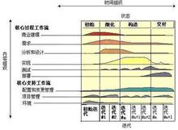

## 简述题

------
1.简述瀑布模型、增量模型、螺旋模型（含原型方法），并分析优缺点 
从项目特点、风险特征、人力资源利用角度思考

 - 瀑布模型：瀑布模型是最基本的和最效的一种可供选择的软件开发生命周期模型.瀑布模型要求软件开发严格按照需求 ->分析->设计->编码->测试的阶段进行,每一个阶段都可以定义明确的产出物和验证准则.瀑布模型在每一个阶段完成后都可以 组织相关的评审和验证,只有在评审通过后才能够进入到下一个阶段.
由于需要对每一个阶段进行验证,瀑布模型要求每一个阶段都有明确的文档产出,对于严格的瀑布模型每一个阶段都不应该重叠,而应该是在评审通过,相关的产出物都已经基线后才能够进入到下一个阶段.   
优点：可以保证整个软件产品较高的质量,保证缺陷能够提前的被发现和解决.采用瀑布模型可以保证系统在整体上的充分把握,使系统具备良好的扩展性和可维护性.        缺点：对于前期需求不明确,而又很难短时间明确清楚的项目则很难很好的利用瀑布模型.另外对于中小型的项目,需求设计和开发人员往往在项目开始后就会全部投入到项目中,而不是分阶段投入,因此采用瀑布模型会导致项目人力资源过多的闲置的情况。        
     
 - 增量模型：以架构为核心，在架构设计完成后系统会被分为相关的子系统和功能模块.每个功能模块间的接口都可以定义清楚.在这种情况下,当模块B的详细设计做完成后往往就没有必要等到其它模块的详细设计都要完全作完才开始编码,因此在架构设计完成后可以将系统分为多个模块并行开发,每个模块仍然遵循先设计和编码测试的瀑布模型思路.   
优点：在瀑布模型的基础上的改进，有着瀑布模型的优点，且进步不扩大化了瀑布模型的人力资源的利用率。  
缺点：通过多线程的方法压缩进度，多线之间较差的联系性可能导致项目的质量下降。         
     
 - 螺旋模型：螺旋模型是遵从瀑布模型即需求->架构->设计->开发->测试的路线，通过不断迭代和风险驱动。螺旋模型是一种演化软件开发过程模型，它兼顾了快速原型的迭代的特征以及瀑布模型的系统化与严格监控。   
优点：
    - 设计上的灵活性,可以在项目的各个阶段进行变更。     
    - 以小的分段来构建大型系统,使成本计算变得简单容易。    
    - 客户始终参与每个阶段的开发,保证了项目不偏离正确方向以及项目的可控性。   
    - 随着项目推进,客户始终掌握项目的最新信息 , 从而他或她能够和管理层有效地交互。    
    - 客户认可这种公司内部的开发方式带来的良好的沟通和高质量的产品。      
    
 缺点：很难让用户确信这种演化方法的结果是可以控制的。建设周期长，而软件技术发展比较快，所以经常出现软件开发完毕后，和当前的技术水平有了较大的差距，无法满足当前用户需求。      
      
2.简述统一过程三大特点，与面向对象的方法有什么关系？   
统一过程三大特点：
 - 1）软件开发是一个迭代过程，      
 - 2）软件开发是由Use Case驱动的，  
 - 3）软件开发是以架构设计（Architectural Design）为中心的。
RUP是一种面向对象的软件开发方法。   

3.简述统一过程四个阶段的划分准则是什么？每个阶段关键的里程碑是什么？     
RUP中的软件生命周期在时间上被分解为四个顺序的阶段，分别是：初始阶段（Inception）、细化阶段（Elaboration）、构造阶段（Construction）和交付阶段（Transition）。      
每个阶段结束于一个主要的里程碑（Major Milestones）；每个阶段本质上是两个里程碑之间的时间跨度。在每个阶段的结尾执行一次评估以确定这个阶段的目标是否已经满足。如果评估结果令人满意的话，可以允许项目进入下一个阶段。     

 - 初始阶段结束时是第一个重要的里程碑：生命周期目标（Lifecycle Objective）里程碑。生命周期目标里程碑评价项目基本的生存能力。   
 - 细化阶段结束时第二个重要的里程碑：生命周期结构（Lifecycle Architecture）里程碑。生命周期结构里程碑为系统的结构建立了管理基准并使项目小组能够在构建阶段中进行衡量。此刻，要检验详细的系统目标和范围、结构的选择以及主要风险的解决方案。   
 - 构建阶段结束时是第三个重要的里程碑：初始功能（Initial Operational）里程碑。初始功能里程碑决定了产品是否可以在测试环境中进行部署。此刻，要确定软件、环境、用户是否可以开始系统的运作。此时的产品版本也常被称为“beta”版。     
 - 在交付阶段的终点是第四个里程碑：产品发布（Product Release）里程碑。此时，要确定目标是否实现，是否应该开始另一个开发周期。在一些情况下这个里程碑可能与下一个周期的初始阶段的结束重合。      
   
4.软件企业为什么能按固定节奏生产、固定周期发布软件产品？它给企业项目管理带来哪些好处？      
RUP的开发过程建立在一系列迭代之上，每次迭代都有一个固定的时间限制（例如四个星期），称为"时间盒"，每次迭代结束的时候都发布一个稳定的小版本，该版本是最终系统的子集。"时间盒"是迭代开发中的关键概念：它意味着迭代周期的期限是固定的，如果目标没有完成，则放弃本次迭代的需求，而不是延长迭代的时间。故软件企业能按固定节奏生产、固定周期发布软件产品。    
RUP提高了团队生产力，在迭代的开发过程、需求管理、基于组件的体系结构、可视化软件建模、验证软件质量及控制软件变更等方面，针对所有关键的开发活动为每个开发成员提供了必要的准则、模板和工具指导，并确保全体成员共享相同的知识基础。它建立了简洁和清晰的过程结构，为开发过程提供较大的通用性。
