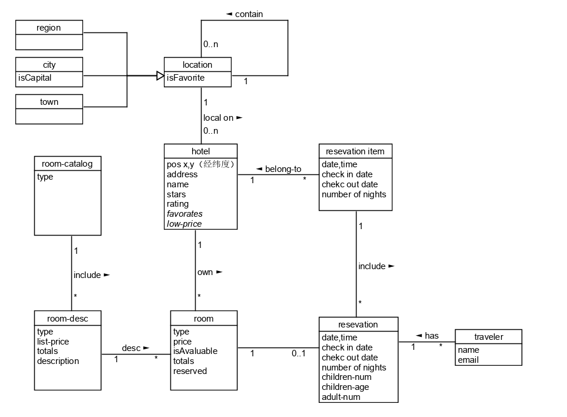
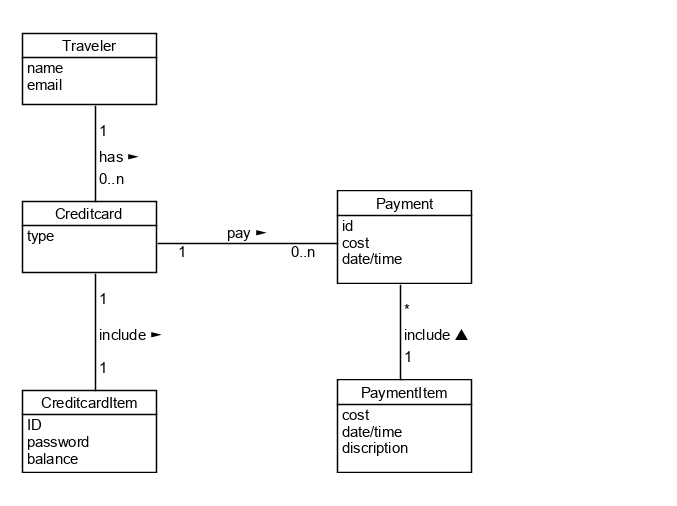
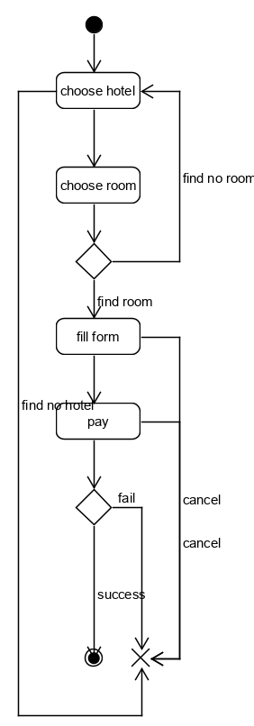

# 系统分析设计作业9
## 使用 UMLet 建模
1、使用类图，分别对 Asg_RH 文档中 Make Reservation 用例以及 Payment 用例开展领域建模。然后，根据上述模型，给出建议的数据表以及主要字段，特别是主键和外键   
注意事项：   
对象必须是名词、特别是技术名词、报表、描述类的处理；  
关联必须有多重性、部分有名称与导航方向  
属性要注意计算字段  
数据建模，为了简化描述仅需要给出表清单，例如： 
Hotel（ID/Key，Name，LoctionID/Fkey，Address…..）  

Make Reservation用例:  
 数据建模：  
Hotel(pos x,y, address, name, stars, rating, /favorates/, /low-price/)   
Room(type, price, isAvaluable, totals, reserved) 
Resevation(date/time, check in date, chekc out date, number of nights, children-num, children-age, adult-num)  
Resevation Item(date/time, check in date, chekc out date, number of nights)  
Room-description(type, list-price, totals, description)  
Payment用例:   
  
数据建模：  
Traveler(name, email)  
Creditcard(type)  
Payment(id, cost, date/time)  
PaymentItem(cost, date/time, discription)  
CreditcardItem(ID, password, balance)  
2、使用 UML State Model，对每个订单对象生命周期建模   
建模对象： 参考 Asg_RH 文档， 对 Reservation/Order 对象建模。  
建模要求： 参考练习不能提供足够信息帮助你对订单对象建模，请参考现在 定旅馆 的旅游网站，尽可能分析围绕订单发生的各种情况，直到订单通过销售事件（柜台销售）结束订单。   
  

---
