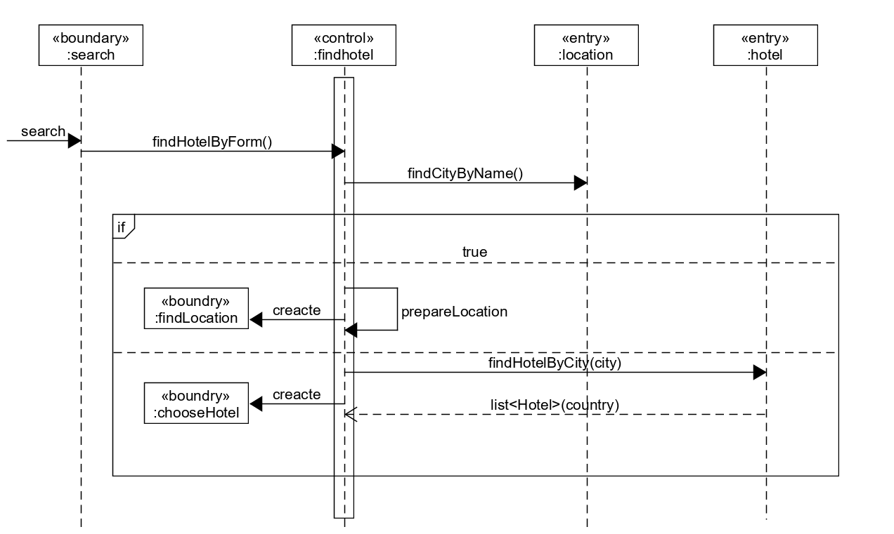
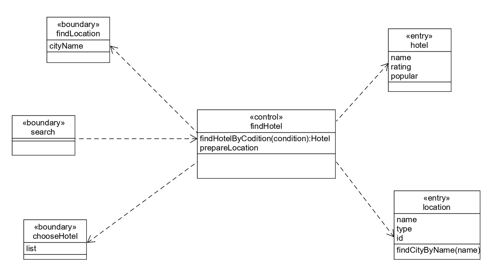
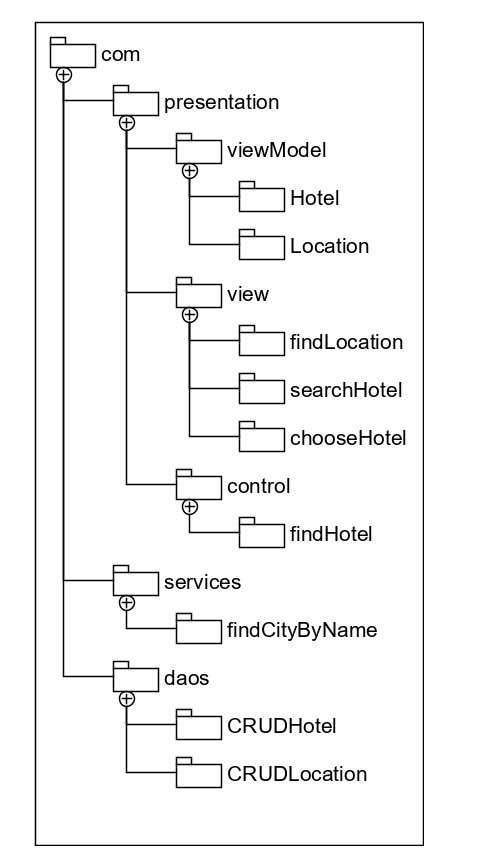

# Homework 16

---

 - 使用 ECB 实现 make reservation 用例的详细设计（包含用例简介，顺序图，类图）
     - 用例简介：
         - 用户能够通过选择入住城市，搜索酒店，能获得酒店信息并预订酒店。
         - Boundary类：
             - search：搜索酒店
         - Control类：
             - findhotel：处理搜索功能  
         - Entry类：  
             - Location：城市信息  
             - Hotel：酒店信息  
     - 顺序图：
         - 
     - 类图：
         - 

 - 将逻辑设计类图映射到实际项目框架的包图。用树形结构表述实现的包和类
     - 包图：
         -   
